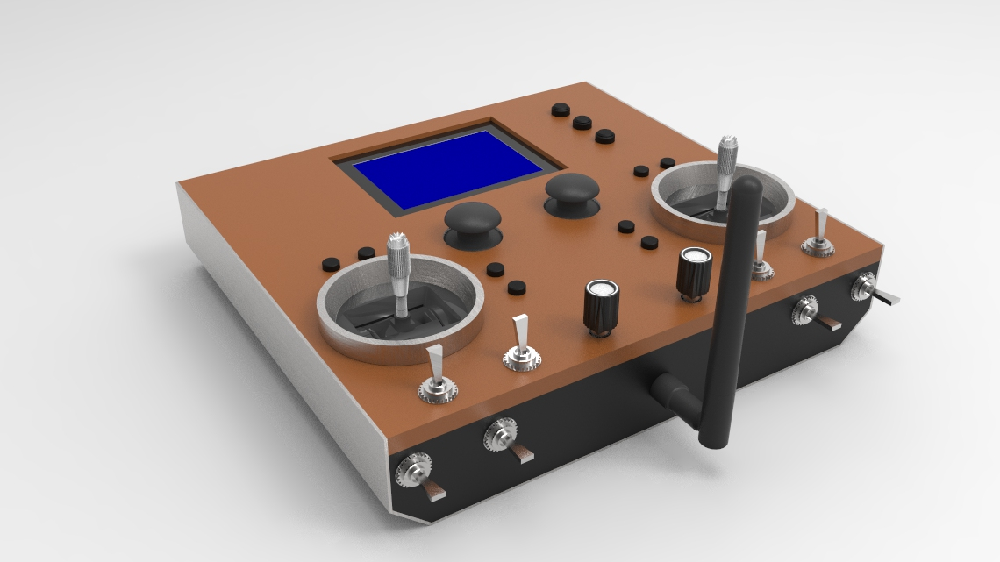
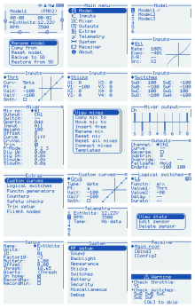

# Arduino based RC system
The ultimate DIY radio control system.
Remotely operate model airplanes, multicopters, boats, land vehicles, robots, or anything you can imagine.

## Main features
- 20 fully proportional RC channels, each channel encoded with 10 bits.
- Configurable RC channel output signal format.
- Update rate of 50x per second for all RC channels.
- Receiver binding, Adjustable RF power, Frequency hopping.
- Reverse, subtrim, endpoints, failsafe.
- Dual rates and expo, Custom curves, Flight modes.
- Powerful mixer system, Logical switches, Custom telemetry.
- Alarms, Warnings, Timers, etc.
- Intuitive user interface.
- Model memory. I2C eeprom and SD card supported.
- Model types, context-aware nomenclature; no need for land vehicles to have controls named after aircraft parts. 

## Hardware and Schematics
The schematics and related information can be found in the 'schematics' folder. 
The major components are as below.
- 1x Atmega2560 microcntroller, 2x Atmega328p microcontrollers.
- 2x SX1276/77/78/79 or RFM95 based Lora modules. However any module can possibly be used.
- 128x64 KS0108 based LCD. Any 128x64 LCD can however be used (provide own driver code).

## Compiling the firmware
The code compiles on arduino ide 1.8.x or later. The code is self-contained so doesn't require installing any libraries. 

## User Interface
Three buttons are used for navigation; Up, Select, Down. Long press Select to go Back.

<em>Note: These screenshots may not reflect the most recent changes.</em>

## Topics
[Mixer](doc/mixer.md)
 [Custom curves](doc/custom_curves.md)
 [Logical switches](doc/logical_switches.md)
 [Telemetry](doc/telemetry.md)
 [Receiver binding and configuration](doc/receiver_config.md)

## Frequently Asked Questions
[Got a question or an issue? See the FAQ first.](doc/faq.md)
